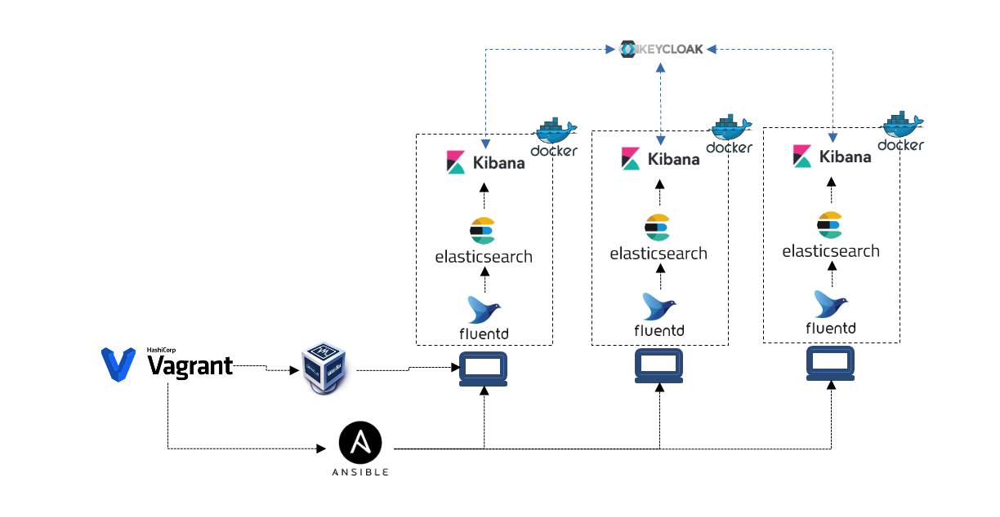

# Distro Elasticsearch + Fluentd + Kibana (EFK) with Docker CONSISTING OF MULTIPLE HOSTS

Docker 기반으로 #Distro Elasticsearch, #Fluentd, #Kibana (EFK)를 Host 간 Dockder Swarm 없이 구성했으며, 이중화를 고려해서 3개의 host에 설치구성했습니다.
그리고 kibana 인증 연동을 Keycloak과 #OpenID 로 연결하여, Keycloak를 통해서 인증 및 Role mapping이 되게 구성했습니다. 또한 keycloak OpenID 연동은 추후 다시 올리도록 하겠습니다.

Docker기반 구성은 Ansible를 통해서 설치되도록 자동화했습니다. 또한 data directory는 host directory를 mount하여 저장 및 관리/확장이 가능하도록 했습니다. 여기에서는 Kibana 접속 로드 분산을 위해서 로드발런서는 구성하지 않았습니다.

여기에 설정된 패스워드는 Default 설정이므로 수정하시길 바랍니다. 

---
- 설치이미지
    - amazon/opendistro-for-elasticsearch:1.13.2
    - fluent/fluentd:v1.6-debian-1
    - amazon/opendistro-for-elasticsearch-kibana:1.13.2
---

- 사전 설치 준비 사항
  로컬 PC에 아래 사항이 설치되어 있어야 합니다.
  - Vagrant
  - Ansible
  - VirtualBox
---

# Chart01. 설치 구성

## 1-1. 소스 다운로드 후 설치

~~~
vagrant up
~~~

## 1-2. Distro ElasticSearch 구성 확인

~~~
curl --user admin:admin http://192.168.99.12:9200/_cat/nodes?v
ip            heap.percent ram.percent cpu load_1m load_5m load_15m node.role master name
192.168.99.14           36          96  14    0.57    0.24     0.15 dimr      -      hostefk03
192.168.99.12           57          64   7    0.38    0.21     0.12 dimr      *      hostefk01
192.168.99.13           63          84  11    0.31    0.15     0.09 dimr      -      hostefk02
~~~

## 1-3. OpenID 적용

보안 설정파일이 docker container에 mount되어 있어서, 이 설정파일을 적용해야 합니다.
컨테이너 내부에서 있는 실행파일을 이용합니다. 파일위치는 /usr/share/elasticsearch/plugins/opendistro_security/tools
입니다.

~~~
vagrant ssh hostefk01

vagrant@hostefk01:~$ docker psCONTAINER ID   IMAGE                                               COMMAND                  CREATED        STATUS          PORTS                                                                                                                                       NAMES
1c28c3df25e3   sparkfluentd:v0.1                                   "tini -- /bin/entryp…"   18 hours ago   Up 2 hours      5140/tcp, 0.0.0.0:24224->24224/tcp, :::24224->24224/tcp                                                                                     odfe-fluentd
7977313930dd   amazon/opendistro-for-elasticsearch:1.13.2          "/usr/local/bin/dock…"   18 hours ago   Up 27 minutes   0.0.0.0:9200->9200/tcp, :::9200->9200/tcp, 0.0.0.0:9300->9300/tcp, :::9300->9300/tcp, 0.0.0.0:9600->9600/tcp, :::9600->9600/tcp, 9650/tcp   efk01
3526c4db575f   amazon/opendistro-for-elasticsearch-kibana:1.13.2   "/usr/local/bin/kiba…"   18 hours ago   Up 2 hours      0.0.0.0:5601->5601/tcp, :::5601->5601/tcp

vagrant@hostefk01:~$ docker exec -it 7977313930dd /bin/bash

[root@hostefk01 elasticsearch]# cd plugins/opendistro_security/tools/

./securityadmin.sh \
   -cd /usr/share/elasticsearch/plugins/opendistro_security/securityconfig/ \
   -icl -nhnv  -cacert /usr/share/elasticsearch/config/root-ca.pem \
   -key /usr/share/elasticsearch/config/kirk-key.pem \
   -cert /usr/share/elasticsearch/config/kirk.pem

Open Distro Security Admin v7
Will connect to localhost:9300 ... done
Connected as CN=kirk,OU=client,O=client,L=test,C=de
Elasticsearch Version: 7.10.2
Open Distro Security Version: 1.13.1.0
Contacting elasticsearch cluster 'elasticsearch' and wait for YELLOW clusterstate ...
Clustername: odfe-cluster
Clusterstate: GREEN
Number of nodes: 3
Number of data nodes: 3
.opendistro_security index already exists, so we do not need to create one.
Populate config from /usr/share/elasticsearch/plugins/opendistro_security/securityconfig/
Will update '_doc/config' with /usr/share/elasticsearch/plugins/opendistro_security/securityconfig/config.yml
   SUCC: Configuration for 'config' created or updated
Will update '_doc/roles' with /usr/share/elasticsearch/plugins/opendistro_security/securityconfig/roles.yml
   SUCC: Configuration for 'roles' created or updated
Will update '_doc/rolesmapping' with /usr/share/elasticsearch/plugins/opendistro_security/securityconfig/roles_mapping.yml
   SUCC: Configuration for 'rolesmapping' created or updated
Will update '_doc/internalusers' with /usr/share/elasticsearch/plugins/opendistro_security/securityconfig/internal_users.yml
   SUCC: Configuration for 'internalusers' created or updated
Will update '_doc/actiongroups' with /usr/share/elasticsearch/plugins/opendistro_security/securityconfig/action_groups.yml
   SUCC: Configuration for 'actiongroups' created or updated
Will update '_doc/tenants' with /usr/share/elasticsearch/plugins/opendistro_security/securityconfig/tenants.yml
   SUCC: Configuration for 'tenants' created or updated
Will update '_doc/nodesdn' with /usr/share/elasticsearch/plugins/opendistro_security/securityconfig/nodes_dn.yml
   SUCC: Configuration for 'nodesdn' created or updated
Will update '_doc/whitelist' with /usr/share/elasticsearch/plugins/opendistro_security/securityconfig/whitelist.yml
   SUCC: Configuration for 'whitelist' created or updated
Will update '_doc/audit' with /usr/share/elasticsearch/plugins/opendistro_security/securityconfig/audit.yml
   SUCC: Configuration for 'audit' created or updated
Done with success   

~~~

## 1-4.접속하기

아래 kibana URL에 접속하면 keycloak URL로 redirect 되어 인증처리를 합니다.

http://192.168.99.12:5601/, http://192.168.99.13:5601, http://192.168.99.14:5601
